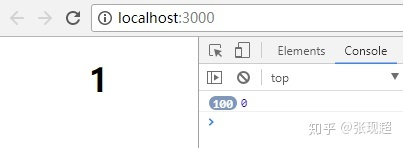
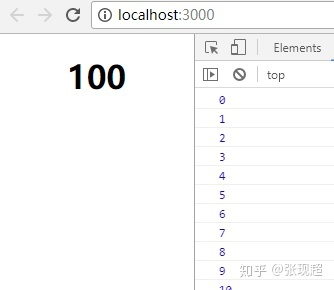

## setState原理

React显然也遇到了这样的问题，所以针对setState做了一些特别的优化：React会将多个setState的调用合并成一个来执行，  
这意味着当调用setState时，state并不会立即更新，举个栗子：

```js
class App extends Component {
    constructor() {
        super();
        this.state = {
            num: 0
        }
    }
    componentDidMount() {
        for ( let i = 0; i < 100; i++ ) {
            this.setState( { num: this.state.num + 1 } );
            console.log( this.state.num );    // 会输出什么？
        }
    }
    render() {
        return (
            <div className="App">
                <h1>{ this.state.num }</h1>
            </div>
        );
    }
}
```

结果： 



组件渲染的结果是1，并且在控制台中输出了100次0，说明每个循环中，拿到的state仍然是更新之前的。

以针对这种情况，React给出了一种解决方案：setState接收的参数还可以是一个函数，在这个函数中可以拿先前的状态，并通过这个函数的返回值得到下一个状态。

```js
import React, { Component } from 'react';

import styles from './index.less';

class Test extends Component {
	constructor() {
			super();
			this.state = {
					num: 0
			}
	}
	componentDidMount() {
    for ( let i = 0; i < 100; i++ ) {
        this.setState( prevState => {
            console.log( prevState.num );
            return {
                num: prevState.num + 1
            }
        } );
    }
}
	render() {
			return (
					<div className="App">
							<h1>{ this.state.num }</h1>
					</div>
			);
	}
}

export default Test;

```


结果： 




### 实现以下两个功能：

1. 异步更新state，将短时间内的多个setState合并成一个

2. 为了解决异步更新导致的问题，增加另一种形式的setState：接受一个函数作为参数，在函数中可以得到前一个状态并返回下一个状态